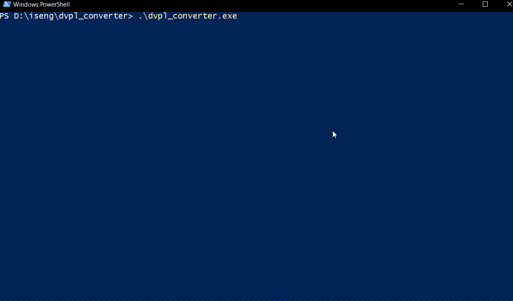

# DVPL Converter

This is a CLI program that converts files to and from the WG WoTB DVPL format.

The following text is a summary of references from [maddoxkkm repository](github.com/maddoxkkm/dvpl_converter) & [archive](https://libraries.io/github/Maddoxkkm/dvpl_converter)

## About DVPL

`.dvpl` is a new file format that is first seen used in the World of Tanks Blitz Client for Chinese Server, and now it's used on all known clients, except files that are contained within Android apks.

## DVPL Specification:

- Starts with stream of Byte data, can be compressed or uncompressed.
- The last 20 bytes in DVPL files are in the following format:
  - UINT32LE input size in Byte
  - UINT32LE compressed block size in Byte
  - UINT32LE compressed block crc32
  - UINT32LE compression Type
    - 0: no compression (format used in all uncompressed `.dvpl` files from SmartDLC)
    - 1: LZ4 (not observed but handled by this decompressor)
    - 2: LZ4_HC (format used in all compressed `.dvpl` files from SmartDLC)
    - 3: RFC1951 (not implemented in this decompressor since it's not observed)
  - 32-bit Magic Number represents "DVPL" literals in utf8 encoding, encoded in big-Endian.

## Usage

- Download the program from the [release page](https://github.com/Tankerch/dvpl_converter/releases)
- (Optional) Place the program in the same directory as the files you want to convert
- Run the program from cmd/terminal with the following commands
  - Interactive: `./dvpl_converter`
  - Convert file to DVPL: `./dvpl_converter encrypt`
  - Convert DVPL to file: `./dvpl_converter decrypt`

> You can run `dvpl_converter --help` for more details about commands and flags

## Build Requirments

- go >= 1.19
