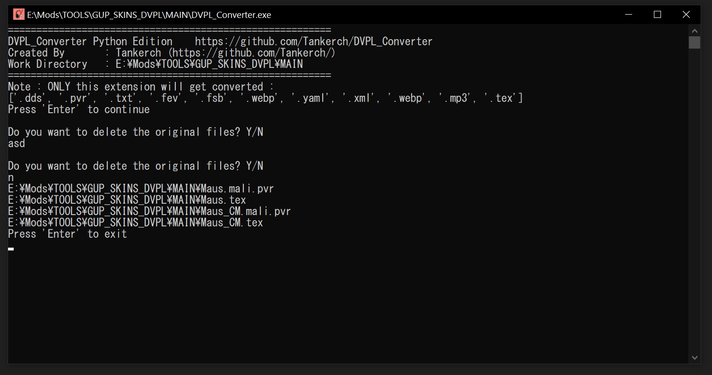

# DVPL Converter C# Edition

Menkonversi file non-DVPL menjadi format DVPL

Tulisan dibawah ini adalah rangkuman referensi dari https://libraries.io/github/Maddoxkkm/dvpl_converter

## Hubungan DVPL dengan LZ4

`.dvpl` adalah format file baru yang pertama kali terlihat digunakan di World of Tanks Blitz Client untuk Server Cina, dan juga baru-baru ini terlihat di Public Open Test Server.

Konverter ini bertujuan untuk dapat mengkonversi secara langsung antara file .dvpl dan non-dvpl standar menggunakan bahasa python.

## Hal-hal yang telah diidentifikasi:

File DVPL adalah file non-dvpl yang dikompres dalam format LZ4_HC, dengan header yang dibuang dan ditambahkan beberapa note dibawahnya sebagai gantinya.

20 byte terakhir dalam file DVPL berada dalam format berikut, dengan masing-masing atribut tambahan sebanyak 4 byte:

> {sizeUncompressed,
> sizeCompressed,
> crc32Compressed,
> compressionType,
> PackFormat::FILE_MARKER_LITE}

## Build
- Target .NET Framework >= 4.7.2
- Menginstall libraries (Disarankan menggunakan NuGet)

## Libraries yang digunakan

1. **crc32 NET** : Untuk menkalkulasi CRC32
2. **K4os.Compression.LZ4** : Kompres file dengan metode LZ4
